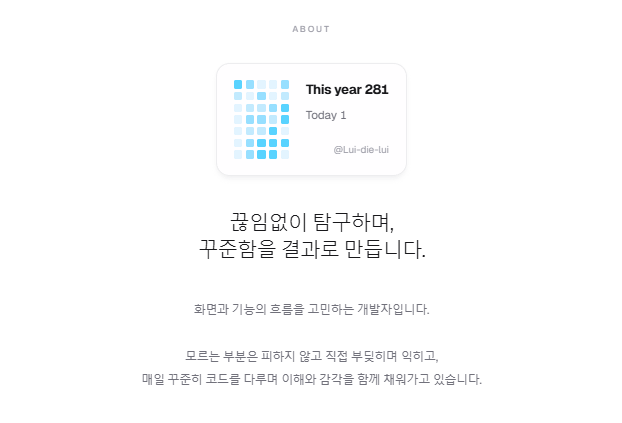
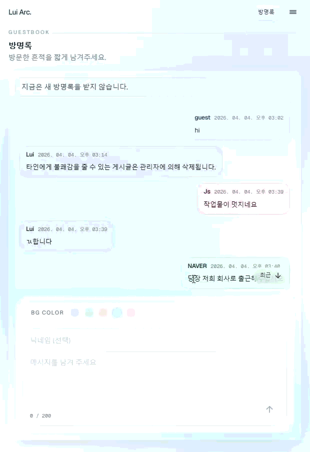
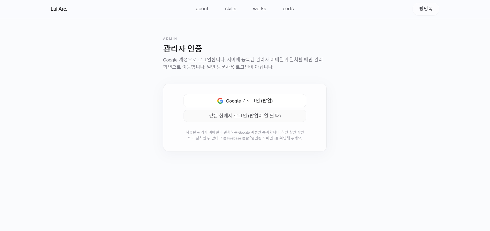
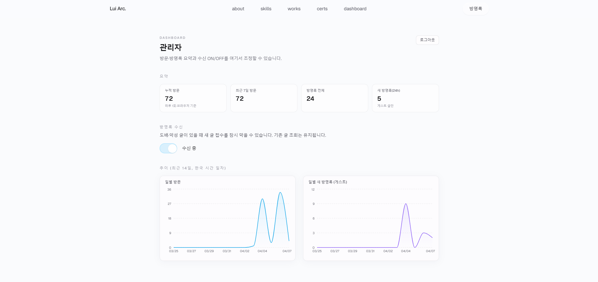

<p align="center">
  
</p>

# Lui Archive

프로젝트 기간: 2026-04-05 ~ 2026-04-06

Next.js(App Router) 기반의 개인 포트폴리오 사이트입니다. 방문자는 한 화면에서 소개·기술·프로젝트·학습 이력을 순서대로 훑을 수 있고, GitHub README·배포 서비스 등 외부 링크로 근거를 바로 열 수 있습니다.

PostgreSQL에 콘텐츠를 두고 **관리자 경로에서만** 수정할 수 있게 해 공개 페이지와 데이터·권한을 분리했습니다. 섹션 순서·앵커 내비·카드 단위 정보 구조와, 섹션·API·문서 단위 유지보수를 같이 맞추는 데 초점을 두었습니다.

---

## 주요 기능

### 방문자

- **단일 메인 페이지**: Hero → About → Skills → Projects → Certs → 방명록 진입 → Footer 순 스크롤 흐름
- **About**: GitHub 기여 활동 카드(서버에서 GraphQL 조회)
- **Skills**: 카테고리별 기술·설명(모바일 캐러셀, 넓은 화면 그리드)
- **Projects**: 요약·태그·**README 링크**·**Live 링크**(배포 URL이 있을 때만)
- **Certs**: 수료·자격 정보, 공개 링크 유무에 따른 표시
- **Guestbook**: `/guestbook`에서 메시지 작성·열람(수신 설정에 따라 비관리자 작성 제한 가능)
- **상단 내비·앵커**: 섹션 이동과 스크롤 보정

### 관리자·운영

- **`/admin`**: 허용 Google 계정만 세션(이메일 화이트리스트 + Firebase ID 토큰 검증)
- **대시보드**: 방문 로그·방명록 요약, 방명록 수신 ON/OFF(`SiteSettings`)
- **Projects / Certs**: DB CRUD, `@dnd-kit`으로 순서 변경 후 저장, 프로젝트 썸네일은 Firebase Storage 업로드 후 URL 저장
- **Guestbook**: 답글·삭제·일괄 선택 삭제 등

---

## 기술 스택

- Next.js 16.2.2 (App Router), React 19.2.4, TypeScript
- Tailwind CSS v4, PostCSS (`@tailwindcss/postcss`), `class-variance-authority`, `clsx`, `tailwind-merge`
- Prisma 6 + PostgreSQL (`@prisma/client` 6.19.x)
- Firebase Authentication(Google), Firebase Admin(ID 토큰 검증), Firebase Storage(썸네일 등)
- GitHub GraphQL API(About 기여 카드, 서버 전용·PAT)
- `@dnd-kit`(관리자 순서 편집), Recharts(대시보드 차트), ESLint(`eslint-config-next`)

---

## 배포 스택

- **플랫폼**: Vercel(Next.js App Router 서버/서버리스)
- **DB**: Supabase Postgres(Transaction Pooler 등 풀러 URL + Prisma 권장 파라미터, 예: `pgbouncer=true`)
- **스키마 반영**: 로컬·CI에서는 `prisma db push` 또는 `prisma migrate` 정책에 맞게 사용(운영은 마이그레이션 이력 관리 권장)
- **인증·스토리지**: Firebase(Web + Admin SDK, Vercel 환경 변수)

---

## 환경 변수

### 데이터베이스

- `DATABASE_URL`: Prisma 런타임·빌드용 연결 문자열(Supabase 풀러 사용 시 `pgbouncer=true` 등 문서 권장 옵션 포함)
- `DIRECT_URL`: `db push` / migrate / Studio 등 직접 연결(보통 5432)

### GitHub(About 카드)

- `GITHUB_USERNAME`: 표시용 핸들(선택)
- `GITHUB_TOKEN`: GraphQL 호출용 PAT(서버 전용)

### 관리자 세션·Firebase Admin

- `ADMIN_EMAIL`: 관리자로 인정할 Google 계정 이메일
- `ADMIN_SESSION_SECRET`: 관리자 세션 HMAC용 시크릿
- `FIREBASE_ADMIN_PROJECT_ID`, `FIREBASE_ADMIN_CLIENT_EMAIL`, `FIREBASE_ADMIN_PRIVATE_KEY`: Firebase Admin(개인 키 줄바꿈은 `\n` 이스케이프 등)

### Firebase Web(클라이언트)

- `NEXT_PUBLIC_FIREBASE_API_KEY`, `NEXT_PUBLIC_FIREBASE_AUTH_DOMAIN`, `NEXT_PUBLIC_FIREBASE_PROJECT_ID`, `NEXT_PUBLIC_FIREBASE_STORAGE_BUCKET`, `NEXT_PUBLIC_FIREBASE_MESSAGING_SENDER_ID`, `NEXT_PUBLIC_FIREBASE_APP_ID`

실제 값은 저장소에 넣지 않습니다. 예시와 주의사항은 루트 **`.env.example`** 및 **`docs/`** 를 참고하세요.

---

## Screen Flow

방문자는 메인 한 페이지에서 전체 맥락을 읽고, 방명록만 별도 URL로 분리했습니다.

| 화면·경로 | 설명 |
|-----------|------|
| `/` | 메인 포트폴리오: Hero ~ Footer 섹션 일렬 |
| `/guestbook` | 방명록 전용(레이아웃·스크롤 동작 분리) |
| `/admin/login` | 관리자 Google 로그인 |
| `/admin` | 대시보드, Projects/Certs/Guestbook·설정 |

**`public/portfolio`** — 화면 구성 캡처(GIF·PNG). 같은 주제는 한 행에 묶었습니다.

방문자·메인

<table>
  <tr>
    <td align="center" valign="top" width="50%">
      <strong>메인 <code>/</code> 스크롤</strong><br />
      
    </td>
    <td align="center" valign="top" width="50%">
      <strong>연락(메일)</strong><br />
      
    </td>
  </tr>
  <tr>
    <td colspan="2" align="center" valign="top">
      <strong>About · GitHub 기여</strong><br />
      
    </td>
  </tr>
</table>

방명록 (방문자·관리자)

<table>
  <tr>
    <td align="center" valign="top" width="50%">
      <strong>방문 · <code>/guestbook</code> 작성</strong><br />
      
    </td>
    <td align="center" valign="top" width="50%">
      <strong>방문 · 수신 OFF</strong><br />
      
    </td>
  </tr>
  <tr>
    <td align="center" valign="top">
      <strong>관리 · 삭제</strong><br />
      
    </td>
    <td align="center" valign="top">
      <strong>관리 · 수신 설정</strong><br />
      
    </td>
  </tr>
</table>

관리자

<table>
  <tr>
    <td align="center" valign="top" width="50%">
      <strong><code>/admin/login</code></strong><br />
      
    </td>
    <td align="center" valign="top" width="50%">
      <strong>대시보드</strong><br />
      
    </td>
  </tr>
  <tr>
    <td align="center" valign="top">
      <strong>Projects · 순서(DnD)</strong><br />
      
    </td>
    <td align="center" valign="top">
      <strong>Projects · 편집</strong><br />
      
    </td>
  </tr>
  <tr>
    <td align="center" valign="top">
      <strong>Certs · 순서(DnD)</strong><br />
      
    </td>
    <td align="center" valign="top">
      <strong>Certs · 편집</strong><br />
      
    </td>
  </tr>
  <tr>
    <td colspan="2" align="center" valign="top">
      <strong>Skills · 편집</strong><br />
      
    </td>
  </tr>
</table>

---

## 문서

- **문서 인덱스**: [`docs/README.md`](./docs/README.md)
- **DB ERD**: [`docs/ERD.md`](./docs/ERD.md)
- **페이지·섹션 개요**: [`docs/overview.md`](./docs/overview.md)
- **Prisma·Supabase 풀러 이슈**: [`docs/troubleshooting-prisma-supabase-pooler.md`](./docs/troubleshooting-prisma-supabase-pooler.md)

---

## 프로젝트 구조

```
app/              App Router 페이지, API Route, 레이아웃
components/       섹션·레이아웃·UI·관리자·게스트북 등
data/             타입·정적 보조 데이터
lib/              Prisma 클라이언트, 인증·API 보조 로직
prisma/           schema.prisma, seed
docs/             설계·운영·트러블슈팅
public/           정적 자산
```

`src/` 디렉터리는 사용하지 않습니다. `components/sections`, `components/admin` 등으로 기능별 탐색을 유지했습니다.

---

## 로컬 개발

```bash
git clone <원격-저장소-URL>
cd lui-archive
npm install
# 루트에 .env 작성(.env.example 참고)

npx prisma db push
npm run db:generate

npm run dev
```

기본 접속: `http://localhost:3000`

초기 데이터가 필요하면 `npm run db:seed`를 사용할 수 있습니다. **운영 DB에는 시드가 기존 데이터를 지우는 구간이 있을 수 있으므로 실행 전 반드시 확인**하세요.

프로덕션 빌드: `npm run build` 후 `npm start`

---

## 구현하면서 신경 쓴 점

- **정보 전달**: 프로젝트 카드에서 설명·태그·README·Live를 역할별로 분리
- **섹션 단위 유지보수**: 메인은 섹션 컴포넌트 조합으로 한 영역 수정이 다른 영역으로 번지지 않게 함
- **데이터와 UI 분리**: 공개 페이지는 Prisma 조회, 민감한 쓰기·관리는 `/admin`과 API에서만
- **접근 제어**: 관리자 이메일 고정 + Firebase 토큰 검증으로 단순한 1인 운영 모델
- **서버리스·DB**: 연결 수·PgBouncer 제약을 고려해 `DATABASE_URL` / `DIRECT_URL` 역할 분리

---

## 트러블슈팅 요약

- **Supabase Transaction pooler + Prisma**: 풀러 URL에 `pgbouncer=true` 등이 맞지 않으면 `prepared statement already exists`(Postgres `42P05`) 등이 날 수 있음 → Prisma·Supabase 문서 기준으로 `DATABASE_URL` 파라미터 점검
- **배포 환경**: 환경 변수 누락·스키마 미반영 시 통계 쿼리 실패 → `DATABASE_URL`·`SiteVisit` 등 테이블 존재 여부 확인

자세한 원인·대응은 `docs/troubleshooting-*.md` 를 참고하세요.

---

## 향후 개선 및 확장 아이디어

- 랜딩페이지 hero section Spline 기반 인터렉션을 적용
- 최근 공개된 텍스트 레이아웃 라이브러리 `@chenglou/pretext` 실험 - 포트폴리오 UI 적용 가능한지 검토
- 작업 기록을 짧게 남길 수 있는 개발 일지 섹션 추가
- 오늘의 공식문서 추천과 같이 가벼운 콘텐츠 추가
